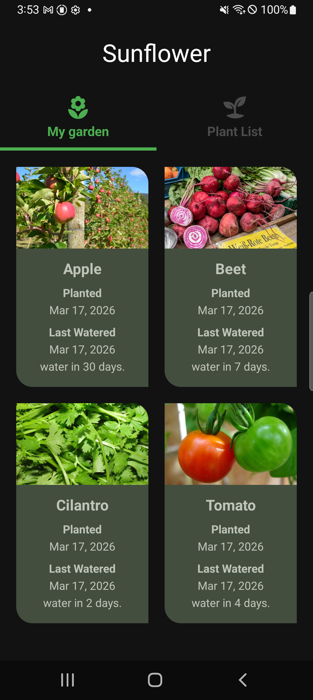
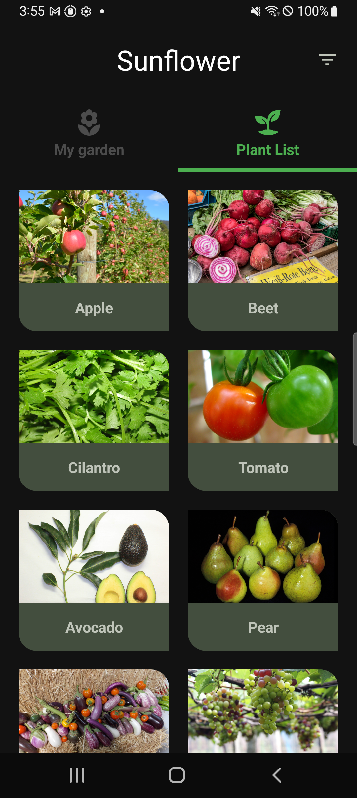
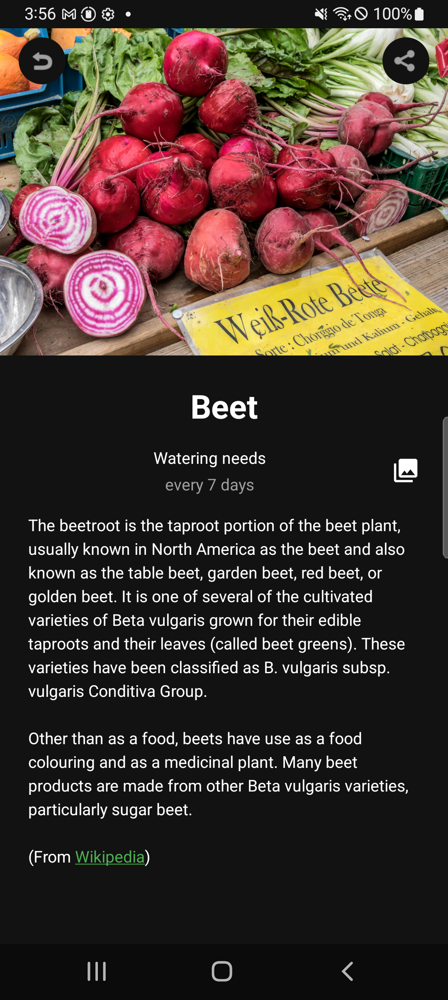
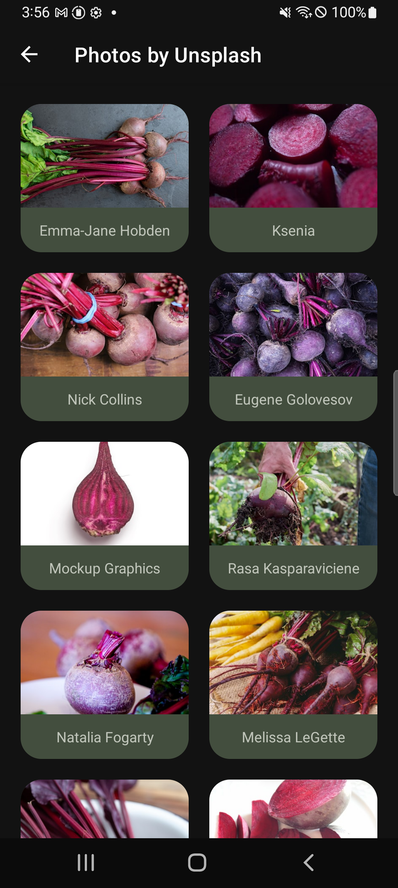
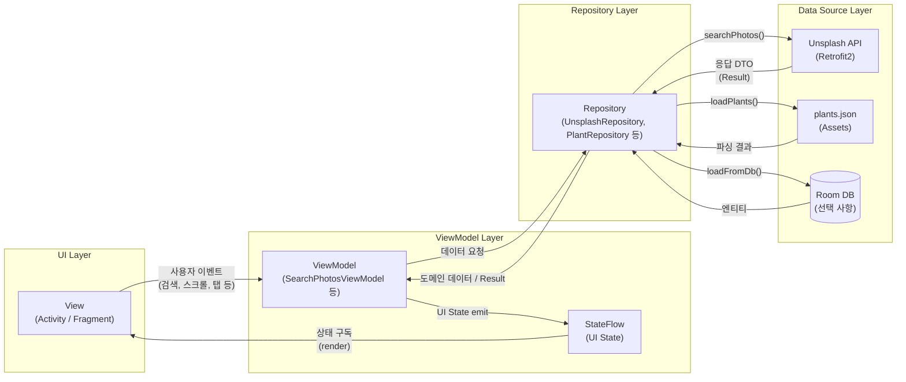

# 🌻 Sunflower (Android MVVM with Unsplash)

MVVM + Coroutines + Flow 기반으로  
네트워크 + 로컬 DB + 상태 관리까지 고려한 Android 아키텍처 프로젝트

---

## 📌 한 줄 요약

- 정적인 식물 데이터 + Unsplash API를 결합하여  
  **검색, 페이징, 상태 관리까지 포함한 실제 서비스 구조를 구현**

---
## 📱 Screenshots
 |  |  |  |
| :---: | :---: | :---: | :---: |
| **메인 화면 (My Garden)** | **식물 리스트 화면** | **식물 상세 화면** | **Unsplash 사진 검색 화면** |

- **Main**: `My garden` / `Plant List` 탭 및 AppBar, 필터 아이콘 상태
- **Plant List**: 식물 리스트 + Grow zone 필터 아이콘
- **Detail**: 식물 정보 + Unsplash 검색으로 진입하는 버튼/아이콘
- **SearchPhotos**: 2열 Grid, 로딩/에러 상태, 페이징 동작
---

## 🤔 왜 이 구조를 선택했는가

### 문제 인식

- View에 로직이 포함되면
  - 테스트 어려움
  - lifecycle 의존성 증가
  - 유지보수 비용 증가

### 해결 전략

- **View = UI만 담당**
- **ViewModel = 상태 + 로직 중심**
- **Repository = 데이터 추상화**

### 결과

- UI / 로직 / 데이터 완전 분리
- ViewModel 단위 테스트 가능
- 네트워크/로컬 데이터 교체 용이

---

## 👀 프로젝트 개요
### 문제 정의

- 정적인 식물 데이터(assets)
- 외부 이미지 API(Unsplash)
- 사용자 로컬 데이터(Room)

👉 이 3가지를 결합해 **정보 + 상태 기반 UI 경험 제공**

---
### 설계 방향

- View는 최대한 얇게 유지 (렌더링 + 이벤트 전달)
- ViewModel이 도메인 로직 중심
- Repository가 데이터 소스(API / DB) 캡슐화
- 공통 인프라는 `common` 패키지로 분리

---

### 결과

- 네트워크 + 로컬 상태를 함께 다루는 구조 확립
- 상태 기반 UI로 복잡한 흐름 관리 가능

---

## ✨ 주요 기능

### 🌼 My Garden (로컬 저장)

- Room DB에 저장된 식물 목록 표시
- 데이터가 없을 경우 Empty UI 노출

#### 설계 포인트

- DB 상태에 따라 UI를 분기 (List / Empty)
- ViewModel에서 Flow로 DB 변경을 구독하여 자동 UI 업데이트
- 데이터 존재 여부 판단은 ViewModel에서 수행 (View는 상태만 렌더링)

---

### 🌱 식물 리스트 / 상세

- assets 기반 식물 목록 표시
- Grow zone 필터
- 상세 화면 이동
- Unsplash 검색 연결

---

### 🔍 Unsplash 검색

- Retrofit 기반 API 연동
- 2열 Grid UI
- 페이징 구현

#### 핵심 로직

- 스크롤 이벤트 → ViewModel 전달
- ViewModel이 로드 여부 판단
- in-flight 요청 관리 (중복 요청 방지)

#### UI 상태

- 초기 로딩 / 추가 로딩 분리
- 에러 → Snackbar 처리
- 화면 회전 시 스크롤 위치 복원

---

## 🧩 해결한 문제

### 1. 중복 페이징 요청

#### 문제

- RecyclerView 스크롤 이벤트는 짧은 시간에 여러 번 발생
- 동일 페이지 중복 API 호출 발생

#### 해결

- ViewModel에서 **in-flight 상태 관리**
- 요청 중에는 추가 요청 차단

---
## ⚖️ 설계 트레이드오프

### Paging3 미사용

#### 선택 이유

- 로직을 명확히 이해하고 직접 제어하기 위해

#### 장점

- 동작 흐름 완전 제어 가능

#### 단점

- cancel / retry / cache 직접 구현 필요
---

## 🧱 아키텍처

### 구조

- MVVM (View - ViewModel - Repository)
- StateFlow 기반 UI 상태 관리

---
### 데이터 흐름

```
View → ViewModel → Repository → (API / Room DB)
                         ↓
                   StateFlow
                         ↓
                       View
```

---


---

### 역할

- **ViewModel**
  - 검색 / 페이징 / DB 상태 처리
  - UI 상태 관리

- **Repository**
  - API / DB 추상화
  - 데이터 소스 통합

- **View**
  - 상태 구독
  - UI 렌더링

---

## 🛠 기술 스택

- Kotlin
- Coroutines / Flow
- Retrofit2 / OkHttp3
- Gson
- Glide
- Room (로컬 DB)
- RecyclerView / ViewPager2

---

## 🧪 테스트

### 전략

- 레이어별 테스트 분리
- ViewModel 중심 상태 테스트

---

### 주요 시나리오

#### SearchPhotosViewModelTest

- 상태 전이 검증
- 페이징 로직 검증
- 중복 요청 방지 검증

---

#### SearchPhotosActivityTest

- RecyclerView UI 검증
- API 호출 흐름 검증

---

#### PlantListFragmentTest

- 필터 동작 검증
- 데이터 일관성 확인

---

## 🔐 보안

- API Key는 코드에 포함하지 않음
- `local.properties` → BuildConfig 주입

```properties
unsplash_access_key=YOUR_UNSPLASH_ACCESS_KEY
```

---

## 🚀 시작하기

### 1. 클론

```bash
git clone https://github.com/f-lab-edu/sunflower_dj.git
```

---

### 2. API Key 설정

```properties
unsplash_access_key=YOUR_UNSPLASH_ACCESS_KEY
```

- BuildConfig로 주입됨
- Git에는 포함되지 않음

> ⚠️ API Key가 없을 경우 이미지 검색 기능은 동작하지 않습니다.

---

### ▶️ 실행

1. Android Studio에서 프로젝트 열기
2. Gradle Sync 완료
3. `app` 모듈 선택
4. 에뮬레이터 또는 실기기에서 실행

---

## 🧪 테스트 (Testing)

### 🎯 테스트 전략

UI, 비동기 로직, 네트워크 경계에서 발생할 수 있는 문제를 방지하기 위해  
레이어별 테스트를 분리하고, ViewModel 중심 상태 기반 테스트를 구성했습니다.

---

### 🔍 주요 테스트 시나리오

#### 1. SearchPhotosViewModelTest

- 검색 성공/실패 시 `SearchPhotosUiState` 상태 전이 검증

페이징 로직:

- 다음 페이지가 존재할 때만 추가 로드
- `onLoadMoreRequested` 연속 호출 시에도 단일 네트워크 요청만 수행
- 로딩 상태 (`isLoadingMore`)의 정확한 전이 검증

---

#### 2. SearchPhotosActivityTest

- `EXTRA_QUERY`로 Activity 실행 시
- ViewModel이 (mock된 Repository를 통해) API 호출 수행
- RecyclerView에 사용자 정보 및 이미지가 정상적으로 표시되는지 검증

---

#### 3. PlantListFragmentTest

- Grow zone 필터 on/off 시 데이터 일관성 검증
  - zone 9 적용 시: 4개
  - 해제 시: 전체 17개 복원

- `waitForAdapterUpdate` 유틸을 사용하여  
  비동기 로딩으로 인한 flaky 테스트 최소화

---
## 📜 Attribution

이 앱은 Unsplash API를 사용하여 이미지를 검색합니다.  
This application uses the Unsplash API but is not endorsed or certified by Unsplash.

---

## 📄 License

이 프로젝트는 개인 학습 및 포트폴리오 목적으로 제작되었습니다.

- 원본 Google Sunflower 프로젝트의 라이선스와 소스 코드는  
  [공식 GitHub 저장소](https://github.com/android/sunflower)에서 확인할 수 있습니다.

## 📁 프로젝트 구조 (요약)
```text
app/
  src/
    main/
      java/com/djyoo/sunflower/
        common/
          gson/          # GsonProvider: 공용 Gson, GsonConverterFactory
          network/       # RetrofitProvider: Retrofit/OkHttp, LoggingInterceptor
        screen/
          main/          # MainActivity, MainViewModel, 탭/툴바/필터 아이콘 상태
          plant/         # PlantListFragment, PlantDetailActivity, Plant 관련 ViewModel/Repository
          garden/        # MyGarden 관련 화면/뷰모델
          search/        # SearchPhotosActivity, SearchPhotosViewModel,
                        # UnsplashApi, UnsplashRepository, DTO 등
    test/
      java/com/djyoo/sunflower/
        screen/
          main/          # MainActivityTest, MainViewModelTest
          plant/         # PlantListFragmentTest, PlantDetailActivityTest, PlantListViewModelTest 등
          garden/        # MyGardenFragmentTest, MyGardenViewModelTest
          search/        # SearchPhotosActivityTest, SearchPhotosViewModelTest
